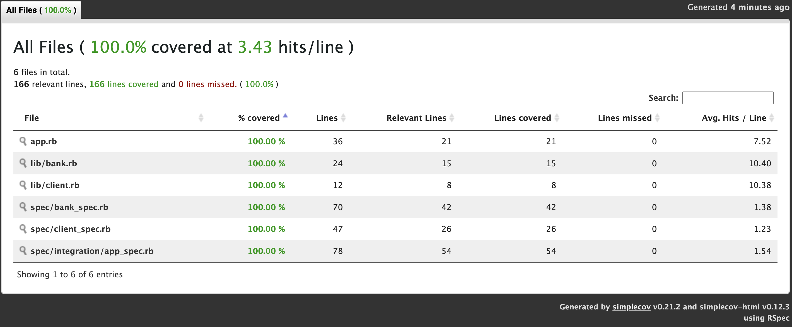

1. What this app does

   - The app will allow the user to create new clients
   - The app will allow the user to deposit and withdraw money from a client's account
   - The app will allow the user to view a statement with all transactions and dates

2. Approach:

   - I am using three classes (Client, Bank and Statement):

   - The Client class takes two arguments, the first name, and the last name. The class constructor validates the inputs and raises an error if they are empty strings or contain digits. The view_client method returns the full name of the client in a capitalized format.

   - The Bank class has three methods, deposit, withdraw, and balance. The deposit and withdraw methods take three arguments, the amount, date, and type (credit or debit). The date and type arguments are optional, and the default date is set to the current date. The deposit method increases the balance by the amount provided and returns a hash with the transaction details. The withdraw method decreases the balance by the amount provided and returns a hash with the transaction details. The balance method returns the current balance of the account.

   - The Statement class has four methods, add_transaction, add_client_to_statement, view_statement, and statement_header. The add_transaction method takes a hash of the transaction details and adds it to the list of transactions. The add_client_to_statement method takes a Client object and stores it in the class for later use. The view_statement method generates a statement for the client by iterating through the transactions and generating a string with the transaction details. The statement_header method returns a string representing the header of the statement.

3. User story:

   Given a client makes a deposit of 1000 on 10-01-2023
   And a deposit of 2000 on 13-01-2023
   And a withdrawal of 500 on 14-01-2023
   When she prints her bank statement
   Then she would see:

   date || credit || debit || balance
   14/01/2023 || || 500.00 || 2500.00
   13/01/2023 || 2000.00 || || 3000.00
   10/01/2023 || 1000.00 || || 1000.00

4. How to run the app
   a. Clone the repository

   git clone https://github.com/Paul3111/bank_tech

   b. If Ruby is not already installed:

   rvm get stable
   rvm use ruby --latest --install --default

   c. Install bundler

   gem install bundler
   bundle init
   bundle install
   rspec --init

   d. Run Rspec with the following command
   rspec

   e. Check the tests coverage by using the following command

   open coverage/index.html

5. Dependencies (required for running the tests)
   - rspec
   - simplecov
   - rubocop
